# Nexus Orchestrator

A multi-tenant workflow-automation platform (Zapier/n8n-style): organizations build workflows, wire them to webhook triggers and conditional branches, run them through a queued execution engine backed by a standalone worker process, and monitor runs through an audit log and operations dashboard.

Built solo, phase by phase, with a dedicated test suite gating every phase before the next began. Full case-study writeup and metrics in [`nexus-orchestrator/`](nexus-orchestrator/case-study.json).

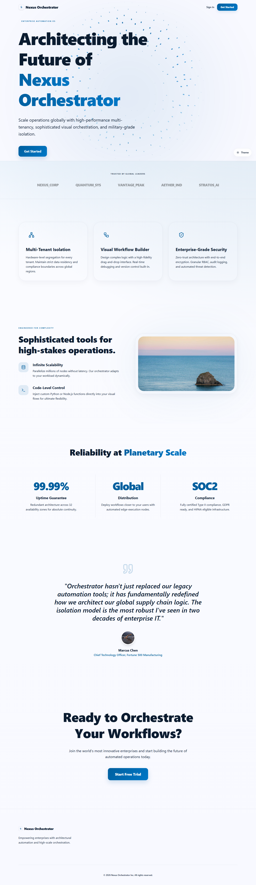

## Screenshots

<table>
<tr><td>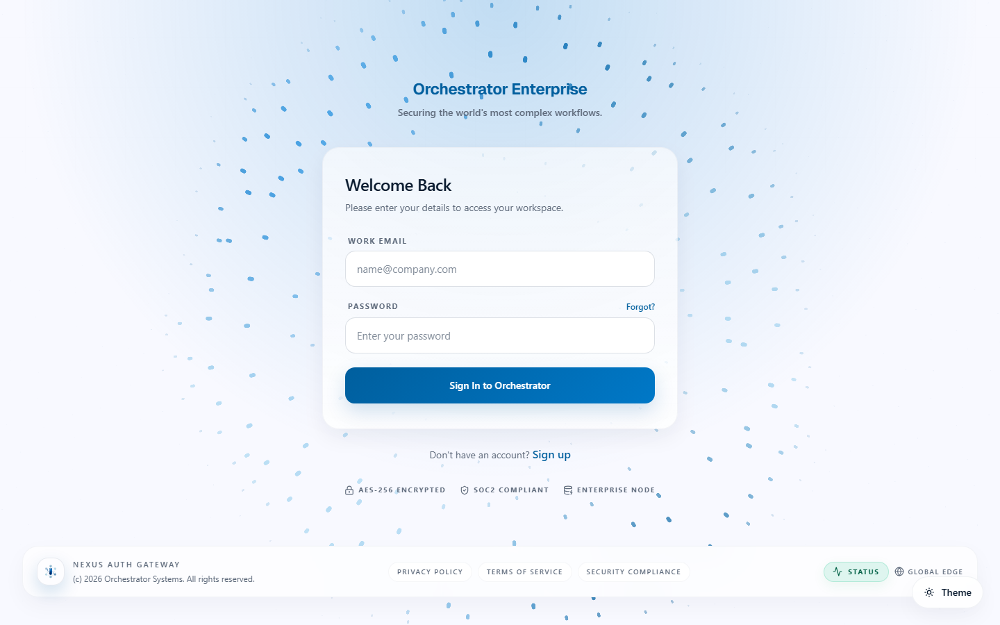<br>Login</td>
<td>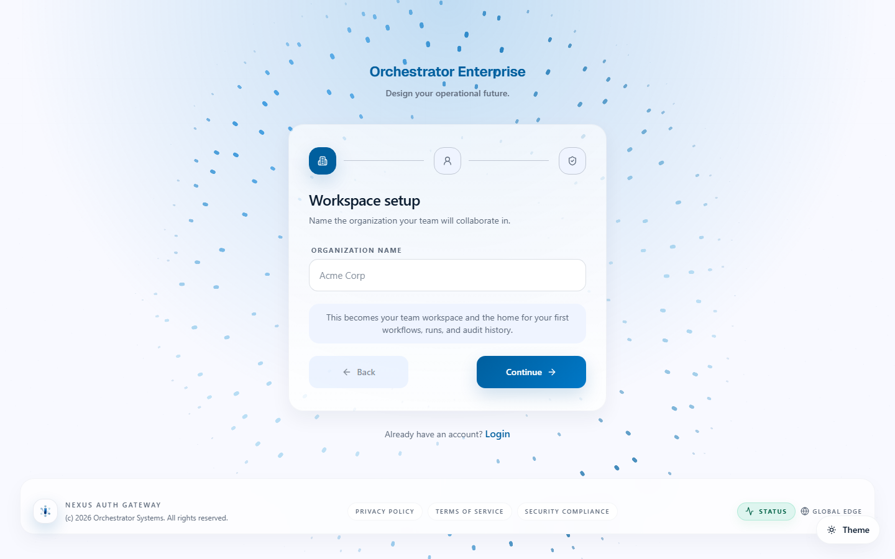<br>Register — workspace setup</td></tr>
<tr><td>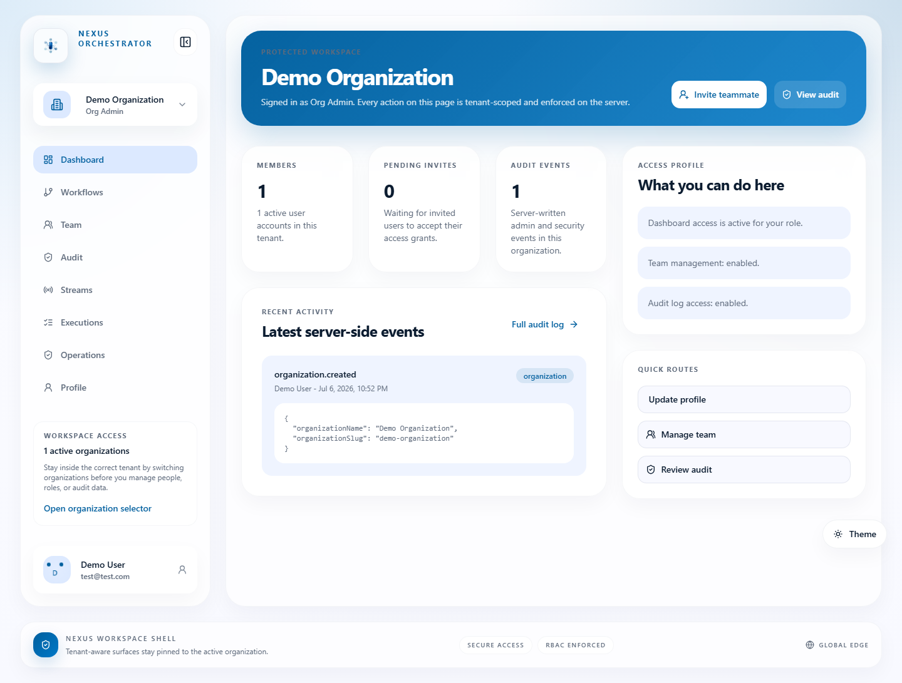<br>Dashboard</td>
<td>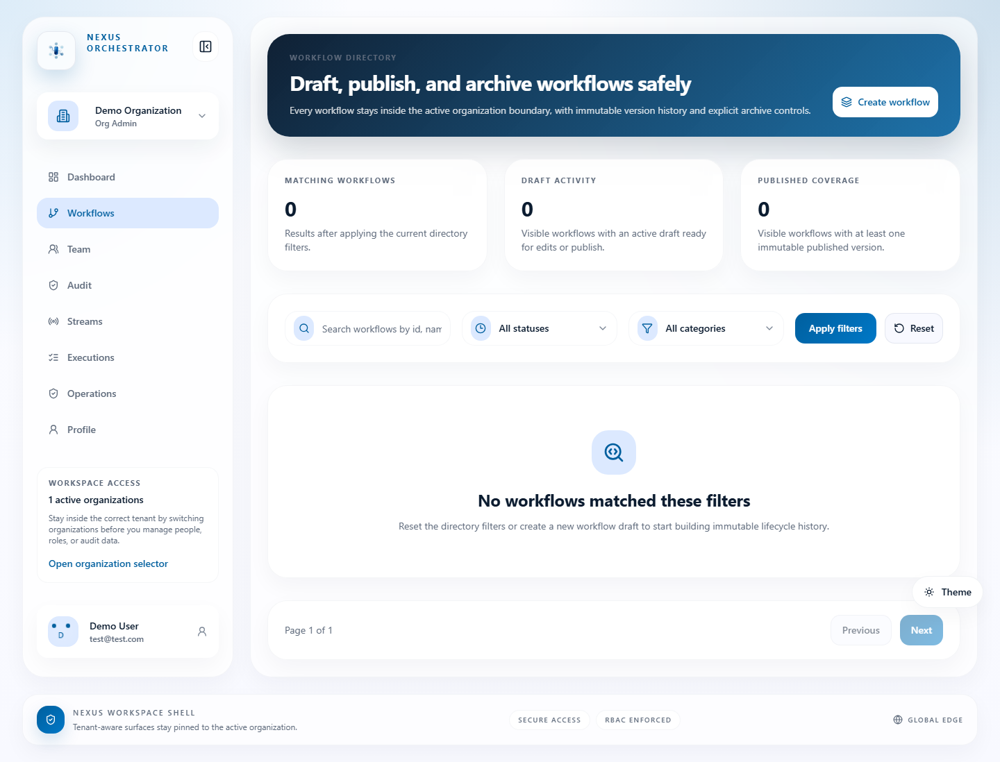<br>Workflows list</td></tr>
<tr><td>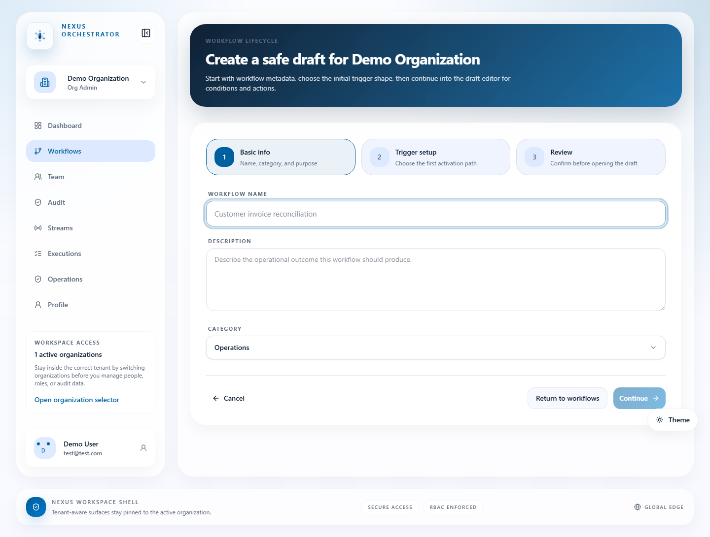<br>Workflow builder (xyflow canvas)</td>
<td>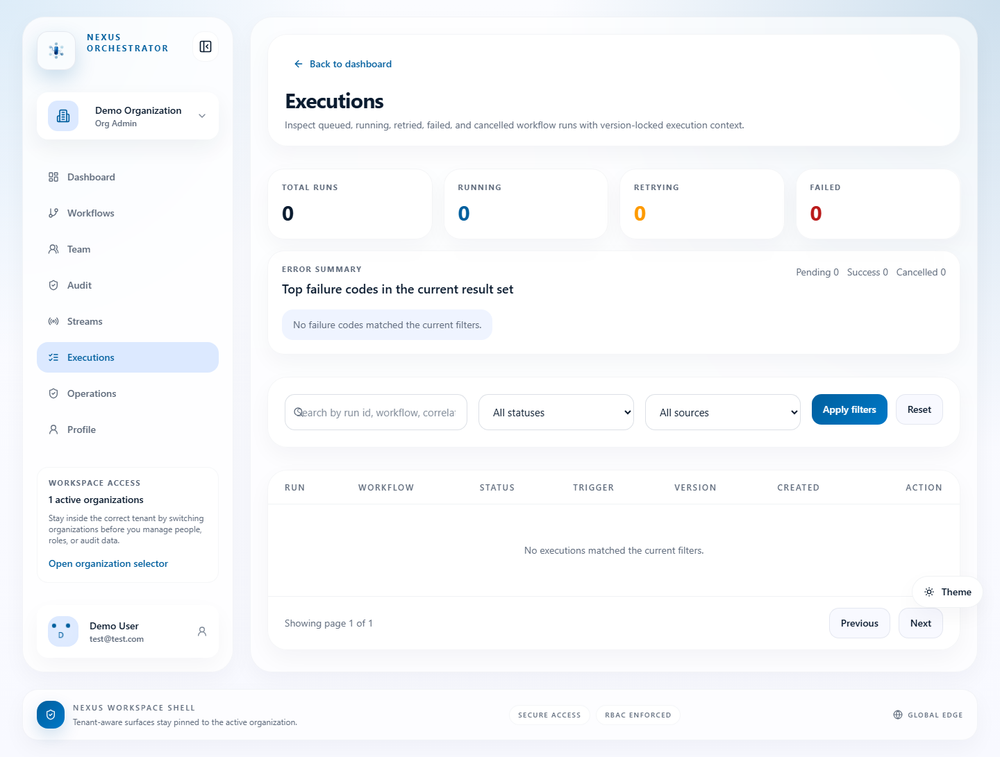<br>Executions</td></tr>
<tr><td>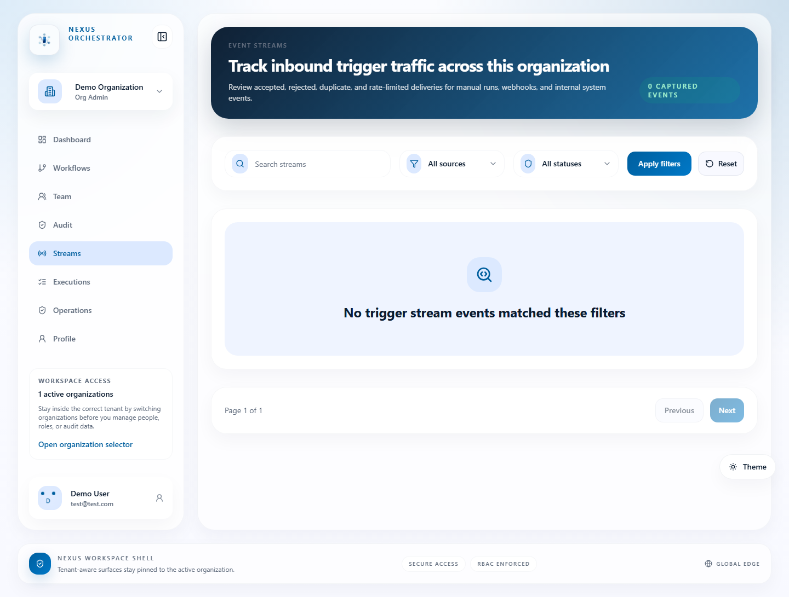<br>Streams (triggers)</td>
<td>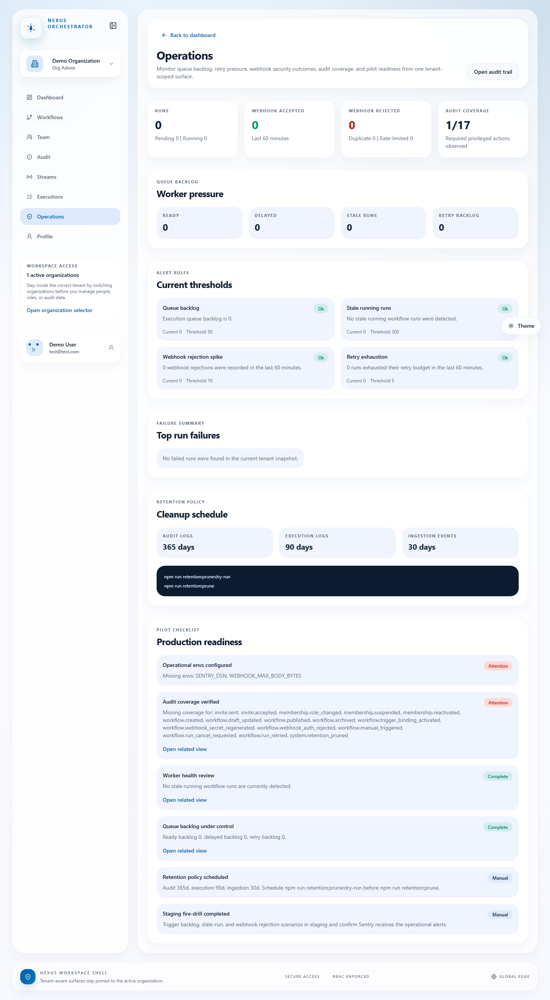<br>Operations dashboard</td></tr>
<tr><td>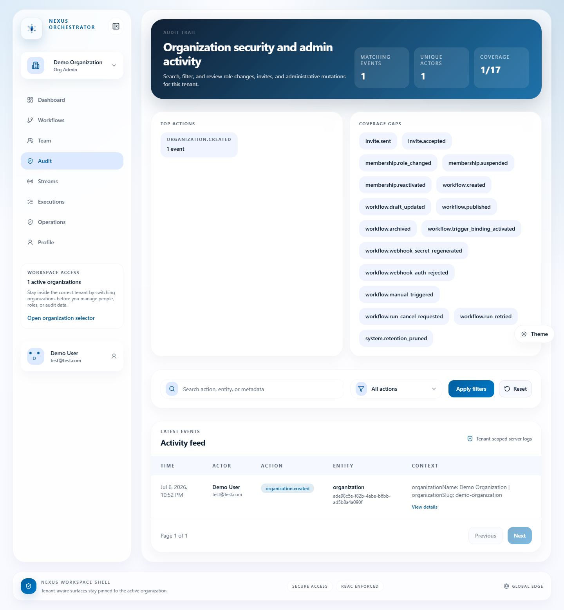<br>Audit log</td>
<td>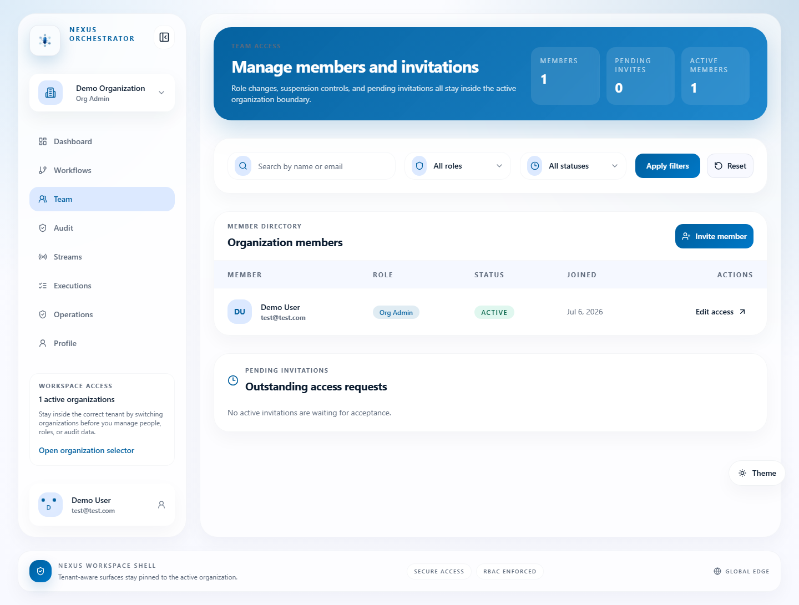<br>Team</td></tr>
<tr><td>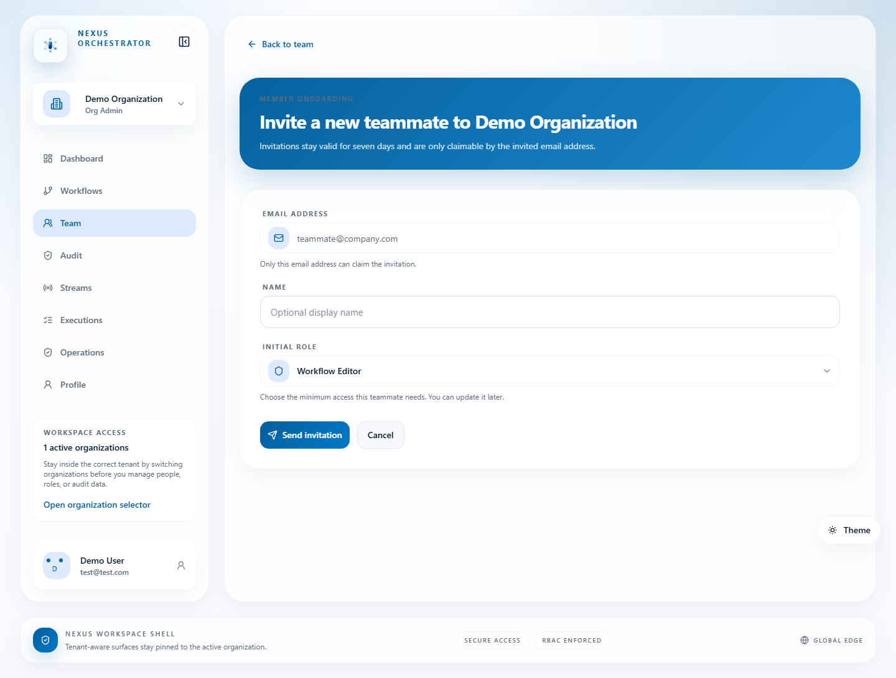<br>Team invite</td>
<td>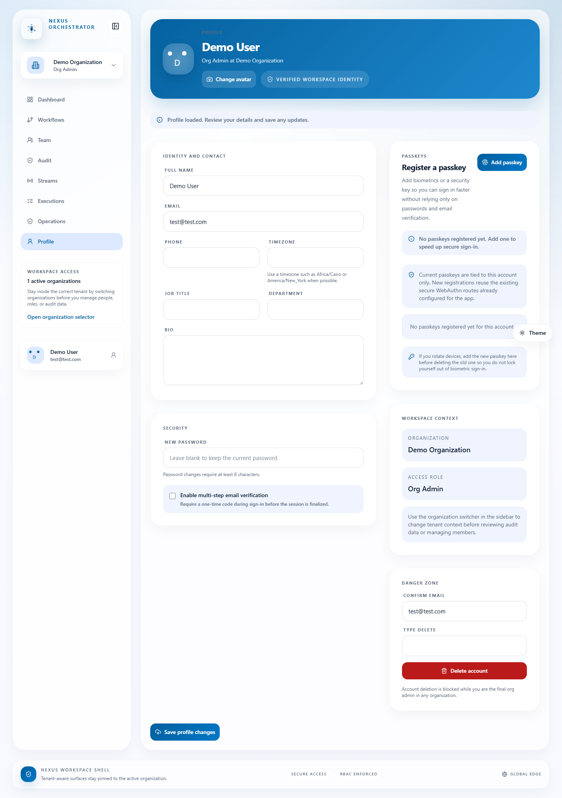<br>Profile / account settings</td></tr>
</table>

More sizes (mobile/tablet) and architecture-decision code excerpts are in [`nexus-orchestrator/screenshots/`](nexus-orchestrator/screenshots/).

## Stack

- **Next.js 16** (App Router, Turbopack) + React 19 / TypeScript 5
- **Supabase/Postgres** — raw `pg` client against hand-written SQL migrations (no ORM)
- **NextAuth (Auth.js) v5** + `next-passkey-webauthn` for WebAuthn passkey auth
- **Standalone worker** (`worker/main.ts`, run via `tsx`) that drains the execution queue
- **Sentry** for error monitoring, wired through a custom recursive redaction layer
- **Resend** + `@react-email/components` for transactional email
- Tailwind CSS 4, Radix UI + `class-variance-authority` (shadcn/ui-style components), `@xyflow/react` for the workflow builder canvas, Zustand + Zod

## Features

- Multi-tenant orgs with invites, membership roles, and per-org audit logging
- Visual workflow builder: CRUD, versioning, webhook trigger ingestion (rate-limited), condition evaluation, pluggable actions (email, outbound webhooks)
- Execution runtime: Postgres-backed queue, worker with polling/heartbeat and retry backoff, an operations dashboard surfacing queue backlog and stale-run alerts
- Production hardening: recursive secret redaction (Sentry + audit log), webhook payload-size guarding, retention-policy pruning scripts

Workspace pages live under `app/org/[orgSlug]/(workspace)/`: `workflows`, `executions`, `streams`, `operations`, `audit`, `team`, `profile`.

## Getting started

```bash
npm install
cp .env.example .env   # fill in Supabase, NEXTAUTH_SECRET, etc.
npm run db:apply-auth-schema
npm run dev             # app on http://localhost:3000
npm run worker:dev      # separate terminal — drains the execution queue
```

At minimum you need a Supabase project (URL + anon + service-role keys) and a generated `NEXTAUTH_SECRET`. Sentry, Resend, and Upstash vars are optional — only required for error reporting, email actions, and rate limiting respectively.

To try it without setting up your own org, run `npm run demo:create-user` and use the seeded demo credentials shown on the login page (reset hourly by `/api/internal/demo/reset` in production).

## Testing

```bash
npm test              # runs all phase + security + operations suites
npm run test:security
npm run test:phase-four   # etc. — see package.json for the full list
```

54 test files under `tests/`, run via Node's built-in test runner (`tsx --test`). No CI is configured — the suite is local-only, so run it before committing.

## Project layout

```
app/            Next.js App Router — (auth) pages, org workspace, api routes
lib/            server logic: org/auth services, observability/redaction, etc.
db/             hand-written SQL schema migrations, applied in phase order
worker/         standalone execution-queue worker (main.ts)
scripts/        db setup, demo user, sitemap, retention pruning
tests/          per-phase + security + operations test suites
docs/           production-readiness checklist
```

## Measured quality

Lighthouse against a real production build (`npm run build && npm run start`), from [`nexus-orchestrator/case-study.json`](nexus-orchestrator/case-study.json) (raw reports in [`nexus-orchestrator/lighthouse/`](nexus-orchestrator/lighthouse/)):

| | Performance | Accessibility | Best Practices | SEO |
|---|---|---|---|---|
| Desktop | 98 | 96 | 96 | 100 |
| Mobile | 79 | 96 | 96 | 100 |

## Status

In development, not deployed. No live URL, no CI pipeline — see `docs/production-readiness-checklist.md` before considering a production deploy.
